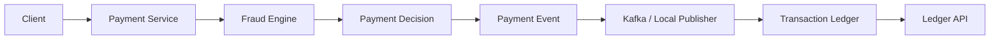
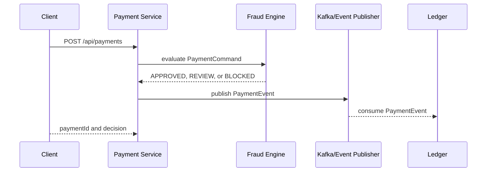

# UPI Payments Simulator Lab - Project Explanation

## What This Project Is

`upi-payments-simulator-lab` is a portfolio-ready fintech backend project that simulates a UPI-style payment platform.

It does not connect to real UPI rails, banks, NPCI systems, or move real money. Instead, it models the engineering shape of a payment system: payment submission, fraud/risk decisioning, event publishing, ledger recording, API documentation, CI, Docker, and live GitHub Pages documentation.

- Repository: [J4vedskh/upi-payments-simulator-lab](https://github.com/J4vedskh/upi-payments-simulator-lab)
- Live documentation: [https://j4vedskh.github.io/upi-payments-simulator-lab/](https://j4vedskh.github.io/upi-payments-simulator-lab/)
- Local project path: `C:\Users\Javed\Documents\GIT HUNT\upi-payments-simulator-lab`

In plain English: this is a mini fintech backend lab that shows how a UPI-like payment flow can be designed, tested, documented, containerized, and improved over time.

## Core Idea

A client submits a payment request with payer VPA, payee VPA, amount, currency, and channel.

Example request:

```json
{
  "payerVpa": "alice@upi",
  "payeeVpa": "merchant@upi",
  "amount": 249.50,
  "currency": "INR",
  "channel": "MOBILE"
}
```

The system then:

1. Accepts the payment request.
2. Runs fraud/risk rules.
3. Produces a decision: `ACCEPTED`, `REVIEW`, or `REJECTED`.
4. Publishes a payment event.
5. Records the event in a transaction ledger.
6. Exposes APIs and documentation around the whole flow.

## Main Modules

The project is a Java 17 Maven multi-module repository. The parent Maven file defines the modules in [`pom.xml`](pom.xml).

| Module | Purpose |
| --- | --- |
| `shared-events` | Shared payment command and event records used across services |
| `fraud-engine` | Pure Java fraud rules and decision logic |
| `payment-service` | Spring Boot REST API for submitting and querying payments |
| `transaction-ledger` | Spring Boot service that records and exposes ledger entries |

## Payment Service

The payment service is responsible for accepting payment commands, calling the fraud engine, creating payment decisions, storing payment outcomes locally, and publishing payment events.

Main API endpoints:

| Endpoint | Purpose |
| --- | --- |
| `POST /api/payments` | Submit a new payment command |
| `GET /api/payments/{paymentId}` | Fetch a payment decision by payment ID |

The controller lives in:

[`payment-service/src/main/java/com/javed/upi/payment/api/PaymentController.java`](payment-service/src/main/java/com/javed/upi/payment/api/PaymentController.java)

The main business flow lives in:

[`payment-service/src/main/java/com/javed/upi/payment/service/PaymentService.java`](payment-service/src/main/java/com/javed/upi/payment/service/PaymentService.java)

When a payment is submitted, `PaymentService`:

1. Creates a unique payment ID.
2. Normalizes the currency and channel.
3. Builds a `PaymentCommand`.
4. Sends the command to the fraud engine.
5. Converts the fraud decision into a payment status.
6. Creates a `PaymentEvent`.
7. Stores the event in memory.
8. Publishes the event.
9. Returns a `PaymentResponse` to the caller.

## Fraud Engine

The fraud engine is the decision brain of the simulator.

It is intentionally implemented as a pure Java module so the rules can be tested quickly without starting Spring Boot.

The implementation lives in:

[`fraud-engine/src/main/java/com/javed/upi/fraud/FraudEngine.java`](fraud-engine/src/main/java/com/javed/upi/fraud/FraudEngine.java)

Current fraud/risk behavior:

| Rule | Decision |
| --- | --- |
| Payer and payee VPA are the same | Reject |
| Payee VPA contains restricted patterns such as `blocked` or `risk` | Reject |
| Amount is greater than or equal to the hard block limit | Reject |
| Amount is greater than or equal to the review limit | Review |
| Currency is not `INR` | Review |
| No findings are triggered | Approve |

Current decision codes:

| Decision Code | Payment Status | Meaning |
| --- | --- | --- |
| `APPROVED` | `ACCEPTED` | Payment passed all configured fraud checks |
| `SELF_TRANSFER` | `REJECTED` | Payer and payee VPA are the same |
| `RESTRICTED_PAYEE` | `REJECTED` | Payee matched a restricted pattern |
| `LIMIT_EXCEEDED` | `REJECTED` | Amount exceeded the configured hard limit |
| `HIGH_VALUE_PAYMENT` | `REVIEW` | Amount requires manual review |
| `NON_INR_PAYMENT` | `REVIEW` | Currency requires review |

The engine returns the highest-risk finding first. A blocked finding takes priority over review findings. If there are no findings, the payment is approved.

## Transaction Ledger Service

The transaction ledger records payment events and exposes lookup APIs.

The controller lives in:

[`transaction-ledger/src/main/java/com/javed/upi/ledger/api/LedgerController.java`](transaction-ledger/src/main/java/com/javed/upi/ledger/api/LedgerController.java)

Main ledger endpoints:

| Endpoint | Purpose |
| --- | --- |
| `POST /internal/events/payments` | Record a payment event directly for local demos |
| `GET /api/ledger` | List all ledger entries |
| `GET /api/ledger/{paymentId}` | Fetch one ledger entry by payment ID |

This gives the project an audit-style component: after a payment decision is made, the system can show a ledger record for that payment.

## Shared Event Contracts

The `shared-events` module contains the common records and enums exchanged between services.

Important shared concepts:

| Type | Purpose |
| --- | --- |
| `PaymentCommand` | Represents an incoming payment intent |
| `PaymentEvent` | Represents the result of a payment decision |
| `PaymentStatus` | Represents the final status, such as `ACCEPTED`, `REVIEW`, or `REJECTED` |

These shared contracts make the payment service, fraud engine, and ledger service speak the same language.

## Architecture

The first version keeps local demos simple while still modeling a production-style flow.



Detailed architecture docs live in:

[`docs/architecture.md`](docs/architecture.md)

## Fraud Decision Flow



## Runtime Profiles

| Profile | Behavior |
| --- | --- |
| Default | Uses in-memory publishing so tests and demos do not require Kafka |
| `kafka` | Publishes and consumes `PaymentEvent` messages through Kafka |
| `secure` | Requires an HS256 JWT with `payment.write` for `POST /api/payments`; payment reads and health/info remain public |

The default profile makes the project easy to run locally. The Kafka profile shows how the system can move toward a more production-like event-driven architecture. The secure profile is deliberately opt-in and reads its signing key from `PAYMENT_JWT_SECRET`, so no credential is committed.

## API Reference

The API documentation lives in:

[`docs/api-reference.md`](docs/api-reference.md)

The OpenAPI contract lives in:

[`docs/api/openapi.yaml`](docs/api/openapi.yaml)

### Submit Payment

```http
POST /api/payments
Content-Type: application/json

{
  "payerVpa": "alice@upi",
  "payeeVpa": "merchant@upi",
  "amount": 249.50,
  "currency": "INR",
  "channel": "MOBILE"
}
```

Example response:

```json
{
  "paymentId": "pay_7b873df0-3928-4d55-b015-bef1bd8cb1bd",
  "payerVpa": "alice@upi",
  "payeeVpa": "merchant@upi",
  "amount": 249.50,
  "currency": "INR",
  "status": "ACCEPTED",
  "decisionCode": "APPROVED",
  "decisionMessage": "Payment passed all configured fraud checks.",
  "decidedAt": "2026-05-27T10:00:00Z"
}
```

### Ledger Lookup

```http
GET /api/ledger/{paymentId}
```

The ledger can also ingest a payment event through:

```http
POST /internal/events/payments
```

This is useful for local demos without Kafka.

## Structured API Errors

The project now includes structured JSON API errors for validation and lookup failures.

Instead of exposing random framework error output, API failures return a predictable shape:

```json
{
  "timestamp": "2026-05-29T10:30:00Z",
  "status": 400,
  "error": "VALIDATION_FAILED",
  "message": "Request validation failed.",
  "path": "/api/payments",
  "validationErrors": {
    "amount": "must be greater than or equal to 0.01",
    "payerVpa": "must not be blank"
  }
}
```

This makes client behavior predictable and keeps API failures easy to demonstrate in tests and documentation.

Related files:

| File | Purpose |
| --- | --- |
| [`payment-service/src/main/java/com/javed/upi/payment/api/ApiErrorResponse.java`](payment-service/src/main/java/com/javed/upi/payment/api/ApiErrorResponse.java) | Payment service error response record |
| [`payment-service/src/main/java/com/javed/upi/payment/api/PaymentApiExceptionHandler.java`](payment-service/src/main/java/com/javed/upi/payment/api/PaymentApiExceptionHandler.java) | Payment service exception handler |
| [`transaction-ledger/src/main/java/com/javed/upi/ledger/api/ApiErrorResponse.java`](transaction-ledger/src/main/java/com/javed/upi/ledger/api/ApiErrorResponse.java) | Ledger service error response record |
| [`transaction-ledger/src/main/java/com/javed/upi/ledger/api/LedgerApiExceptionHandler.java`](transaction-ledger/src/main/java/com/javed/upi/ledger/api/LedgerApiExceptionHandler.java) | Ledger service exception handler |

## Tests

The project includes unit and controller tests.

Current test coverage includes:

| Area | Examples |
| --- | --- |
| Fraud rules | Approval, review, and rejection decisions |
| Payment service | Payment submission behavior and event publishing |
| Payment API | Successful submission, validation errors, and missing payment lookup |
| Payment security | Missing token, insufficient scope, accepted `payment.write` scope, and public payment lookup |
| Ledger service | Recording and retrieving ledger entries |
| Ledger API | Structured not-found response |

Representative test files:

| File | Purpose |
| --- | --- |
| [`fraud-engine/src/test/java/com/javed/upi/fraud/FraudEngineTest.java`](fraud-engine/src/test/java/com/javed/upi/fraud/FraudEngineTest.java) | Fraud engine behavior tests |
| [`payment-service/src/test/java/com/javed/upi/payment/service/PaymentServiceTest.java`](payment-service/src/test/java/com/javed/upi/payment/service/PaymentServiceTest.java) | Payment service tests |
| [`payment-service/src/test/java/com/javed/upi/payment/api/PaymentControllerTest.java`](payment-service/src/test/java/com/javed/upi/payment/api/PaymentControllerTest.java) | Payment API controller tests |
| [`payment-service/src/test/java/com/javed/upi/payment/api/PaymentSecurityTest.java`](payment-service/src/test/java/com/javed/upi/payment/api/PaymentSecurityTest.java) | Secure-profile authorization boundary tests; default compatibility remains covered by `PaymentControllerTest` |
| [`transaction-ledger/src/test/java/com/javed/upi/ledger/service/TransactionLedgerServiceTest.java`](transaction-ledger/src/test/java/com/javed/upi/ledger/service/TransactionLedgerServiceTest.java) | Ledger service tests |
| [`transaction-ledger/src/test/java/com/javed/upi/ledger/api/LedgerControllerTest.java`](transaction-ledger/src/test/java/com/javed/upi/ledger/api/LedgerControllerTest.java) | Ledger API controller tests |

Run all tests:

```bash
mvn -T 1C test
```

## Platform And Portfolio Pieces

This project is designed to look good as a GitHub portfolio project, so it includes more than Java code.

It currently includes:

| Area | Implementation |
| --- | --- |
| Language/runtime | Java 17 |
| Backend framework | Spring Boot |
| Build system | Maven multi-module project |
| APIs | REST APIs for payments and ledger |
| Validation | Jakarta validation on payment requests |
| Error contracts | Structured API error responses |
| Security | Opt-in Spring Security resource-server profile with `payment.write` scope authorization |
| Eventing | Local publisher by default, Kafka profile for event publishing/consuming |
| Infrastructure | Docker Compose for Kafka, PostgreSQL, and services |
| Deployment starters | Kubernetes manifests |
| CI | GitHub Actions Java CI |
| Documentation | MkDocs Material |
| Live docs | GitHub Pages |
| Diagrams | Mermaid architecture and sequence diagrams |
| API contract | Versioned OpenAPI YAML |
| Roadmap | Daily improvement queue and portfolio roadmap |

## Docker And Local Infrastructure

The local infrastructure is defined in:

[`docker-compose.yml`](docker-compose.yml)

It includes:

| Service | Purpose |
| --- | --- |
| `kafka` | Event broker for the Kafka runtime profile |
| `postgres` | Starter database service for future persistence work |
| `payment-service` | Containerized payment API |
| `transaction-ledger` | Containerized ledger API |

Kafka is exposed to local JVM processes on `localhost:29092` and to containers on `kafka:9092`.

Run Kafka locally:

```bash
docker compose up -d kafka
```

## CI And Documentation Deployment

The Java CI workflow is in:

[`/.github/workflows/java-ci.yml`](.github/workflows/java-ci.yml)

It runs:

```bash
mvn -T 1C test
```

The documentation workflow is in:

[`/.github/workflows/docs-pages.yml`](.github/workflows/docs-pages.yml)

It:

1. Installs Python.
2. Installs documentation dependencies from `docs/requirements.txt`.
3. Runs `mkdocs build --strict`.
4. Publishes the site to GitHub Pages on pushes to `main`.

## Documentation Site

The documentation site is built with MkDocs Material.

Important documentation files:

| File | Purpose |
| --- | --- |
| [`README.md`](README.md) | Main GitHub landing README |
| [`mkdocs.yml`](mkdocs.yml) | MkDocs site configuration |
| [`docs/index.md`](docs/index.md) | Docs homepage |
| [`docs/architecture.md`](docs/architecture.md) | Architecture diagrams and service responsibilities |
| [`docs/api-reference.md`](docs/api-reference.md) | API examples and decision codes |
| [`docs/api/openapi.yaml`](docs/api/openapi.yaml) | Versioned OpenAPI contract |
| [`docs/roadmap.md`](docs/roadmap.md) | Planned future improvements |
| [`docs/daily-progress.md`](docs/daily-progress.md) | Automation branch rules and progress log |

Build docs locally:

```bash
pip install -r docs/requirements.txt
mkdocs build --strict
```

## Current Capabilities

| Capability | Status |
| --- | --- |
| Payment command submission | Ready |
| Fraud rules and tests | Ready |
| Transaction ledger service | Ready |
| Kafka runtime profile | Starter |
| Docker Compose infrastructure | Starter |
| Kubernetes manifests | Starter |
| Structured API error responses | Ready |
| GitHub Actions CI | Ready |
| GitHub Pages documentation | Ready |
| Durable PostgreSQL persistence | Roadmap |
| JWT-secured payment submission profile | Ready (opt-in) |
| Observability with traces and metrics | Roadmap |

## Current Progress

The daily progress mechanism is documented in:

[`docs/daily-progress.md`](docs/daily-progress.md)

Current daily improvement log:

| Date | Improvement | Verification |
| --- | --- | --- |
| 2026-08-27 | Added an opt-in JWT-secured payment submission profile with scoped write authorization. | `mvn -T 1C test` passed locally: 16 tests, 0 failures/errors/skips |
| 2026-05-29 | Added structured payment API error responses, controller tests, and error response docs. | `mvn -T 1C test` passed locally |

## Daily Automation Plan

The project is intended to improve over time using a daily Codex automation.

Automation goals:

1. Make exactly one real improvement per run.
2. Avoid fake, empty, backdated, cosmetic-only, or misleading commits.
3. Verify changes before publishing.
4. Work through the rolling branch `codex/daily-progress`.
5. Open or update a pull request into `main`.
6. Wait for checks.
7. Merge to `main` if checks pass.
8. Confirm documentation and Pages deployment progress.

Improvement themes include:

| Theme | Example Improvements |
| --- | --- |
| Features | Persistence, richer fraud rules, payment status transitions |
| Tests | Kafka integration tests, controller tests, contract validation |
| Docs | Diagram refinements, API examples, runbook updates |
| Platform | Docker image publishing, Helm chart, CI hardening |
| Observability | Metrics, tracing, dashboards, operational alerts |

## Roadmap

The roadmap is documented in:

[`docs/roadmap.md`](docs/roadmap.md)

Near-term planned improvements:

| Priority | Improvement | Why It Matters |
| --- | --- | --- |
| P1 | Add PostgreSQL persistence for payments and ledger entries | Makes the simulator closer to real payment platforms |
| P1 | Add Testcontainers for Kafka integration tests | Verifies the event path beyond unit tests |
| P2 | Add OpenTelemetry tracing and Prometheus metrics | Improves observability story |
| P2 | Add richer fraud rules with configurable thresholds | Makes the fraud engine more realistic |
| P2 | Add GitHub Pages API rendering | Makes API docs easier to browse |
| P3 | Add Helm chart and Minikube walkthrough | Strengthens platform engineering presentation |

## Why This Project Matters

For recruiters, reviewers, or engineering managers, this project shows more than isolated Java classes.

It demonstrates:

- service-oriented backend design
- payment-domain modeling
- fraud/risk rule implementation
- event-driven thinking
- API validation and error contracts
- auditable transaction outcomes
- testable local behavior
- CI and documentation discipline
- Docker/Kubernetes platform readiness
- live documentation presentation
- continuous improvement through daily automation

The project is intentionally framed as a lab because it is meant to keep growing. Each improvement should make it more realistic, more testable, more observable, or more presentable.

## How To Explain It In An Interview

Short version:

> This is a Java 17 Spring Boot fintech lab that simulates a UPI-style payment flow. A payment request goes through validation, fraud rules, event publishing, and ledger recording. The project includes tests, Docker/Kafka starters, OpenAPI docs, CI, and GitHub Pages documentation.

More technical version:

> It is a multi-module Maven system with shared event contracts, a pure Java fraud rules engine, a payment command API, and a ledger service. The default runtime uses in-memory event publishing for fast local demos, while the Kafka profile models an event-driven production shape. The project is documented with MkDocs and deployed through GitHub Pages, with CI verifying Java tests and documentation builds.

Portfolio version:

> The goal is to show backend, fintech, platform, and documentation discipline in one public project. It is not just a CRUD API; it models payment decisions, auditability, service boundaries, event contracts, and progressive delivery.

## What The Project Is Not

This project is not:

- a real UPI integration
- a bank-grade production payment switch
- an NPCI-certified payment system
- a real fraud detection ML platform
- a system that moves actual money

It is a simulator and portfolio lab intended to demonstrate architecture, coding, testing, documentation, and platform skills.

## Quick Start

Build and test all modules with JDK 17:

```bash
mvn -T 1C test
```

Run the services locally without Kafka:

```bash
mvn -pl payment-service spring-boot:run
mvn -pl transaction-ledger spring-boot:run
```

Submit a payment:

```bash
curl -X POST http://localhost:8081/api/payments \
  -H "Content-Type: application/json" \
  -d "{\"payerVpa\":\"alice@upi\",\"payeeVpa\":\"merchant@upi\",\"amount\":249.50,\"currency\":\"INR\",\"channel\":\"MOBILE\"}"
```

Run infrastructure for the Kafka profile:

```bash
docker compose up -d kafka
```

## Summary

`upi-payments-simulator-lab` is a mini UPI-style payment backend that currently supports payment submission, opt-in scoped JWT authorization, fraud decisions, event publishing, ledger recording, structured API errors, tests, CI, Docker/Kafka starters, OpenAPI docs, Mermaid architecture diagrams, and GitHub Pages documentation.

Its value is that it tells a clear portfolio story: practical backend engineering for a fintech-style domain, with room to grow into persistence, managed identity integration, observability, integration testing, and deployment hardening.
