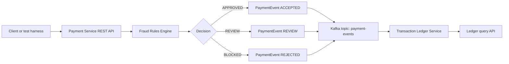
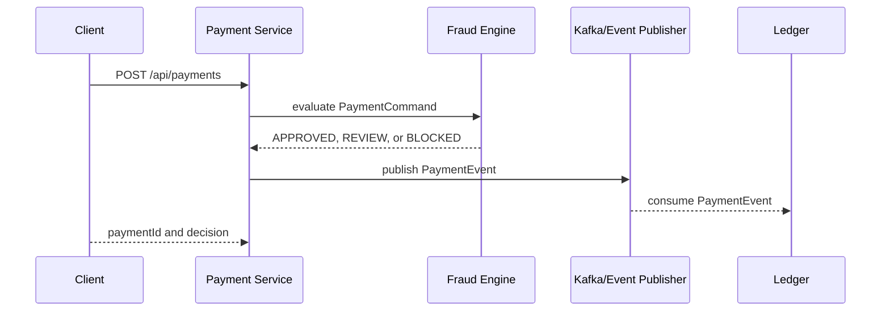

# Architecture

The first release keeps local demos simple while still modeling the production shape: a command API evaluates fraud rules, emits a payment event, and a ledger service records the decision.

## Service Responsibilities

| Component | Responsibility |
| --- | --- |
| `shared-events` | Versioned command and event records shared by services |
| `fraud-engine` | Pure Java fraud rules with fast unit tests |
| `payment-service` | REST API for payment submission and fraud decisions |
| `transaction-ledger` | Records events and exposes payment ledger lookups |

## Fraud Decision Flow

## Profiles

| Profile | Behavior |
| --- | --- |
| Default | Uses in-memory publishing so tests and demos do not require Kafka |
| `kafka` | Publishes and consumes `PaymentEvent` messages through Kafka |

