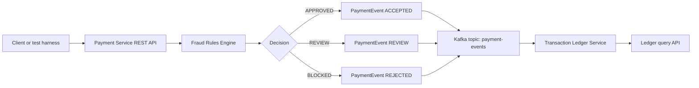
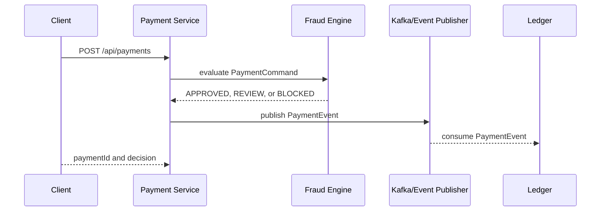

# Architecture

The first release keeps local demos simple while still modeling the production shape: a command API evaluates fraud rules, emits a payment event, and a ledger service records the decision.

## Service Responsibilities

| Component | Responsibility |
| --- | --- |
| `shared-events` | Versioned command and event records shared by services |
| `fraud-engine` | Pure Java fraud rules with fast unit tests |
| `payment-service` | REST API for payment submission and fraud decisions |
| `transaction-ledger` | Records events and exposes payment ledger lookups |

## Fraud Decision Flow

## Profiles

| Profile | Behavior |
| --- | --- |
| Default | Uses in-memory publishing so tests and demos do not require Kafka |
| `kafka` | Publishes and consumes `PaymentEvent` messages through Kafka |
| `secure` | Requires an HS256 JWT with `payment.write` for payment submission while keeping payment reads and health/info public |

## Security Boundary

Security is deliberately opt-in so the original local and test workflow does not
change. In the `secure` profile, the payment service runs as a stateless OAuth2
resource server. It validates JWT signatures with a Base64 key provided through the
runtime environment, maps the standard `scope` claim to Spring Security authorities,
and checks `SCOPE_payment.write` before the controller handles `POST /api/payments`.

This symmetric-key decoder is a self-contained lab profile, not an identity-provider
integration. A production deployment should use managed key distribution and add
issuer and audience validation.

